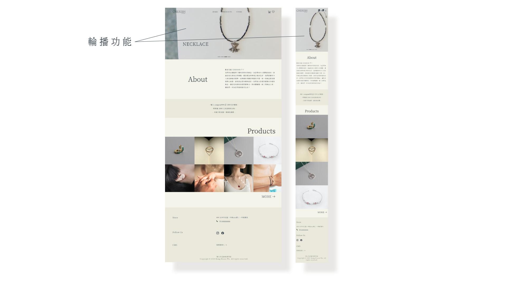
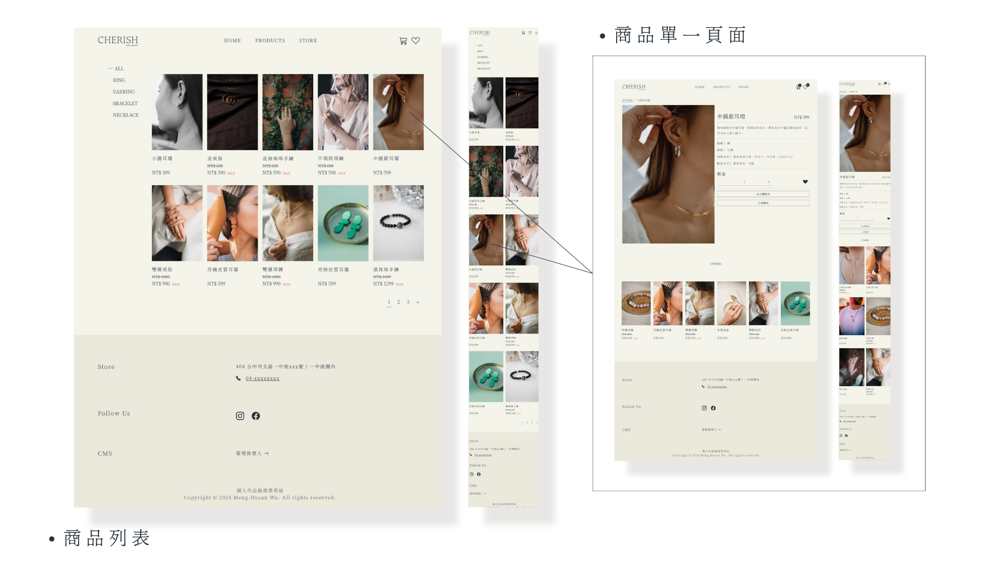
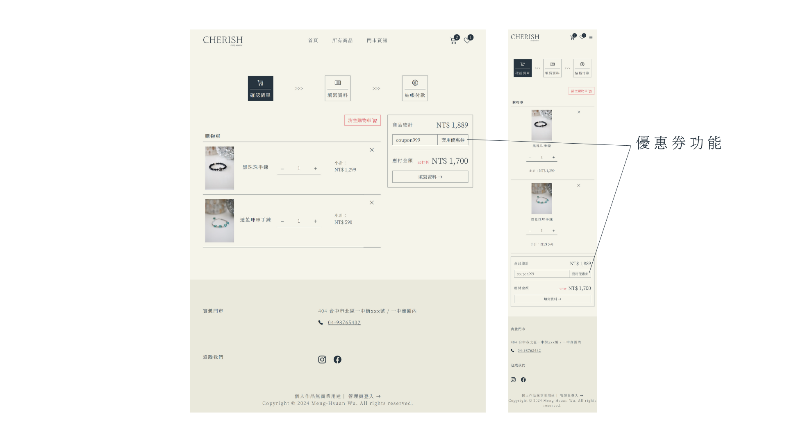
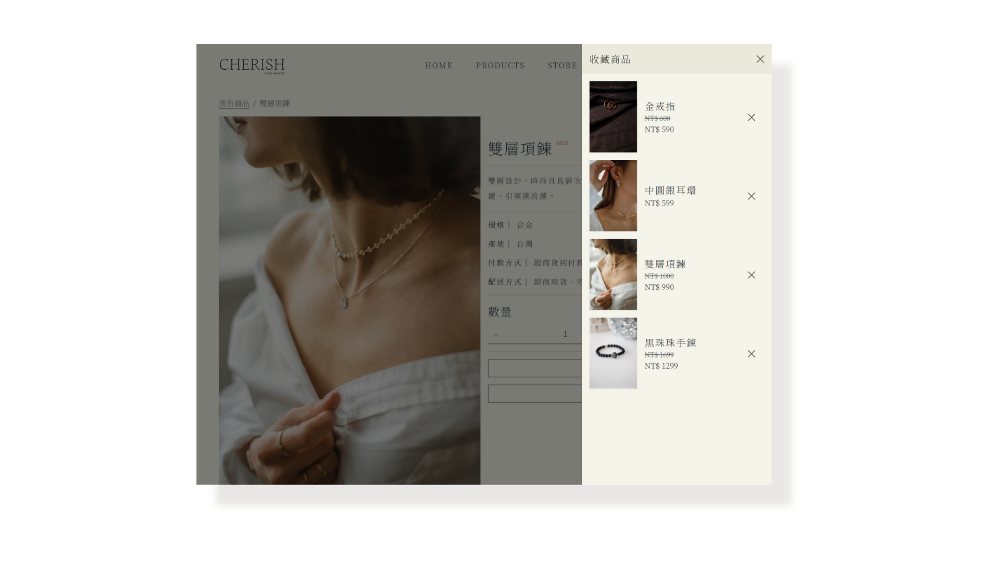
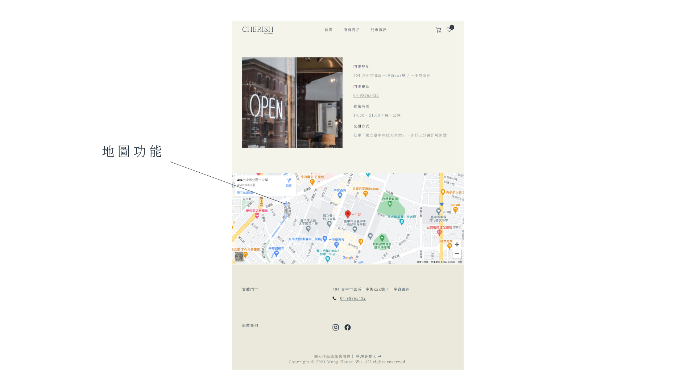
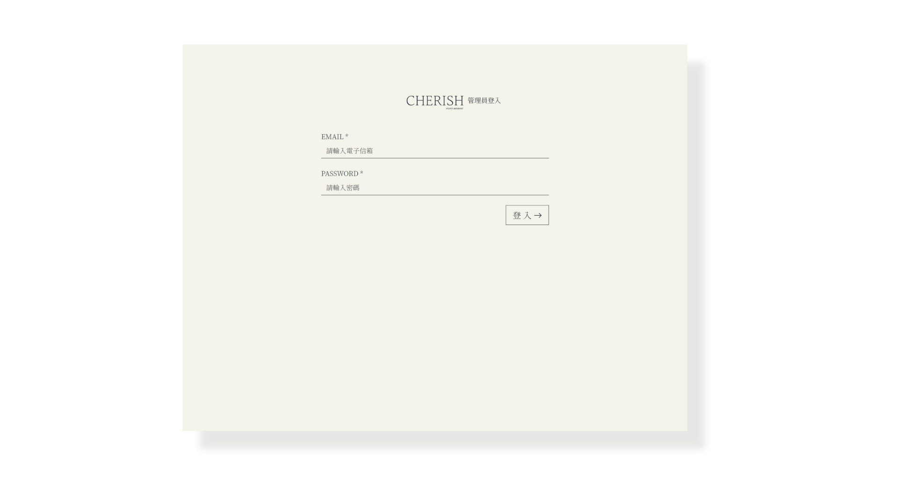
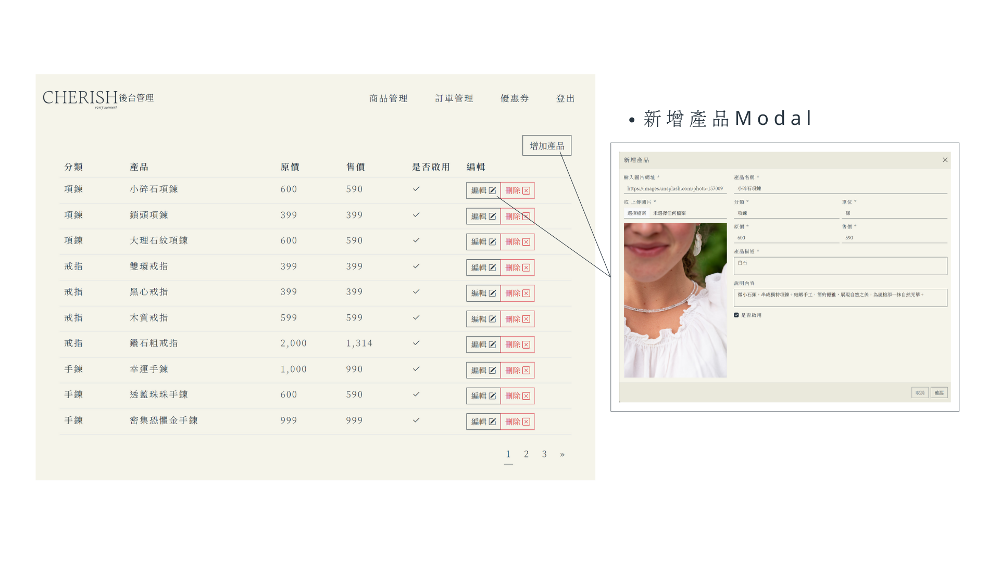
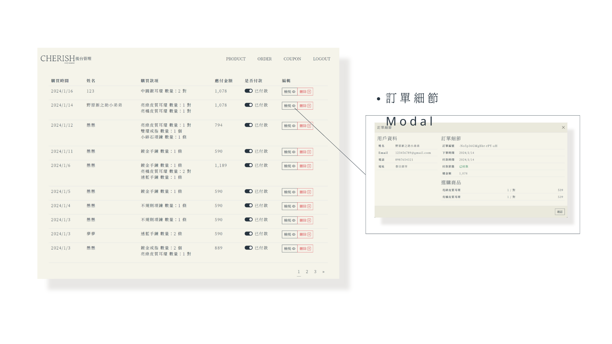
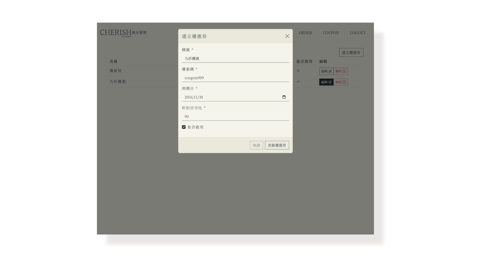

# CHERISH 飾品電商


## 專案介紹
[Demo Website](https://hsuan890125.github.io/CHERISH/#/)

以飾品電商為主題的 SPA 網站，包含 RWD 設計，而網頁整體以簡約風格為主。

### 使用技術
- `SCSS`
- `Vue 3`
- `Vue Cli`
- `Vue Router`
- `Vue Axios`
- `vue-loading-overlay`
- `Vee Validation`
- `RWD`
- `Bootstrap 5`

---
## 前台頁面展示（買家端）

### 首頁


### 商品頁


### 購物車功能


### 收藏功能

使用 localStorage 來儲存收藏商品的資料



### 內嵌地圖



## 後台頁面展示（賣家端）

### 登入


### 商品管理


### 訂單管理


### 優惠券管理


<!-- ---
## Project setup
```
npm install
```

### Compiles and hot-reloads for development
```
npm run serve
```

### Compiles and minifies for production
```
npm run build
```

### Customize configuration
See [Configuration Reference](https://cli.vuejs.org/config/). -->
