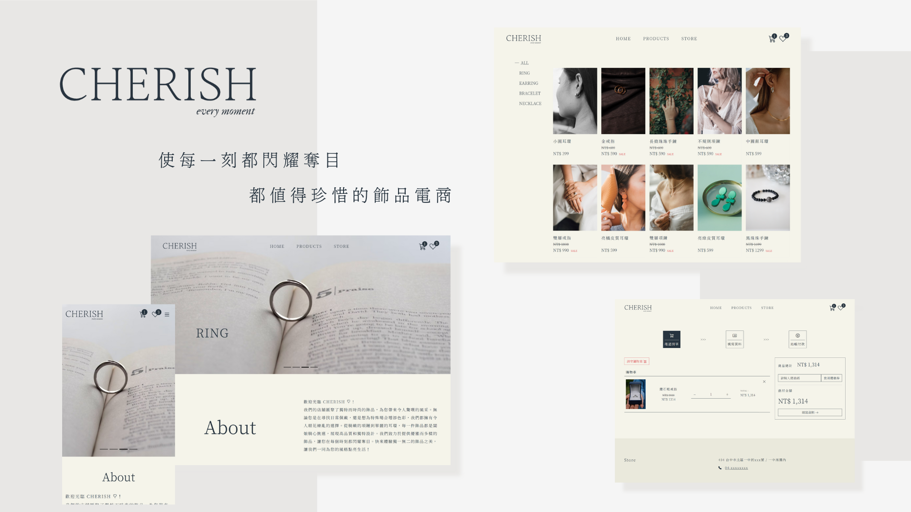

# CHERISH 飾品電商


## 專案介紹
<!-- > Demo Website : [https://a94s84.github.io/Hermosa/#/](https://a94s84.github.io/Hermosa/#/) -->

以飾品電商為主題的 SPA 網站。

### 使用套件
- `Vue 3`
- `Vue Cli`
- `Vue Router`
- `Vue Axios`
- `vue-loading-overlay`
- `Vee Validation`
- `Bootstrap 5`

---
## 前台（買家端）

### 首頁


### 商品頁


### 購物車功能


### 收藏功能


### 內嵌地圖


## 後台（賣家端）

### 登入


### 商品管理


### 訂單管理


### 優惠券管理

---
## Project setup
```
npm install
```

### Compiles and hot-reloads for development
```
npm run serve
```

### Compiles and minifies for production
```
npm run build
```

### Customize configuration
See [Configuration Reference](https://cli.vuejs.org/config/).
